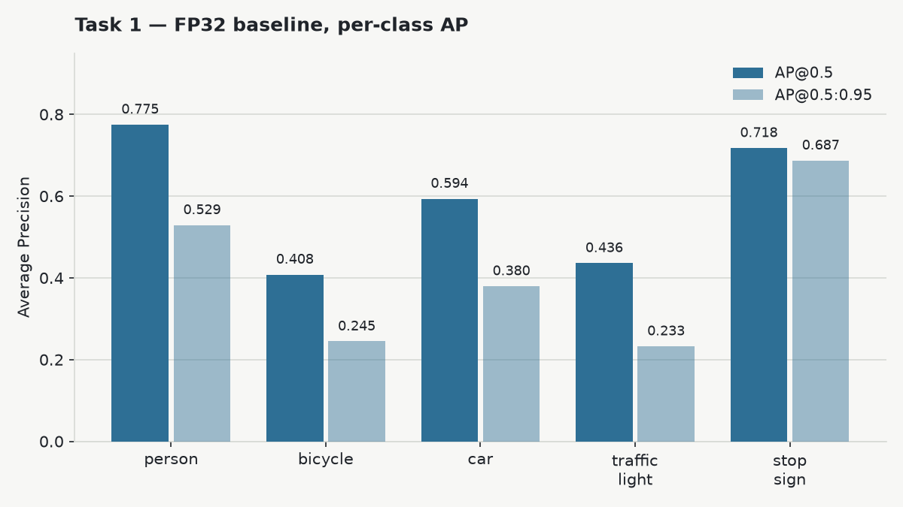
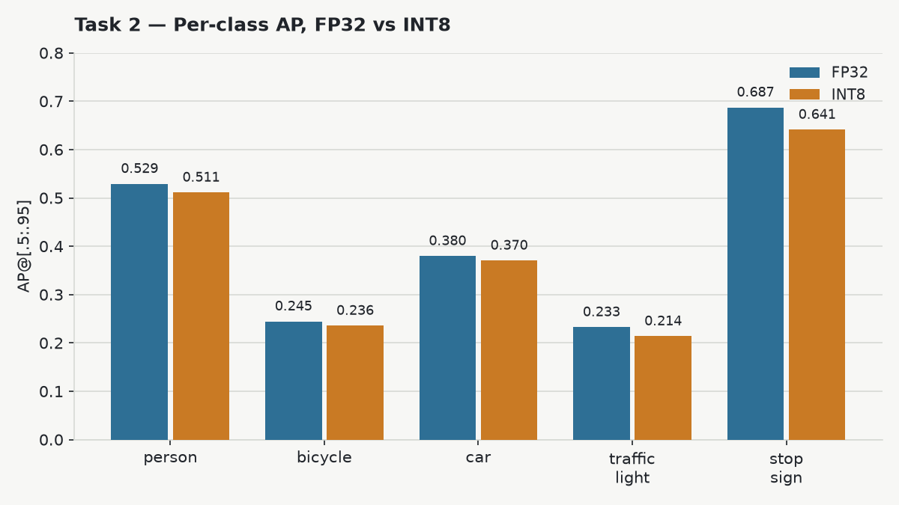
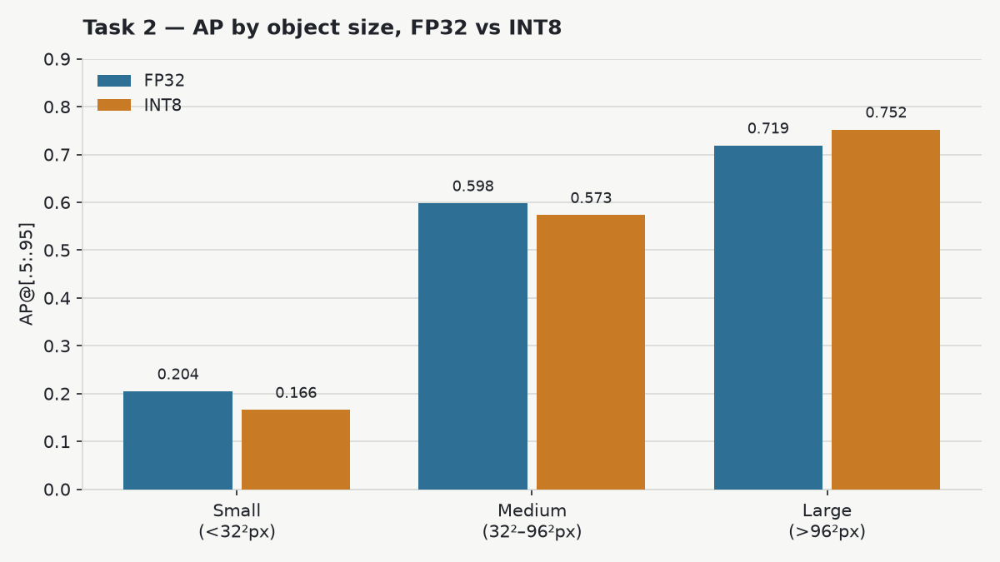
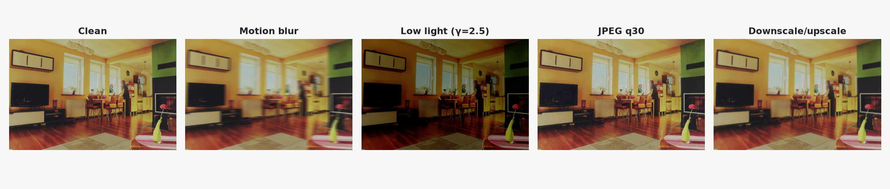
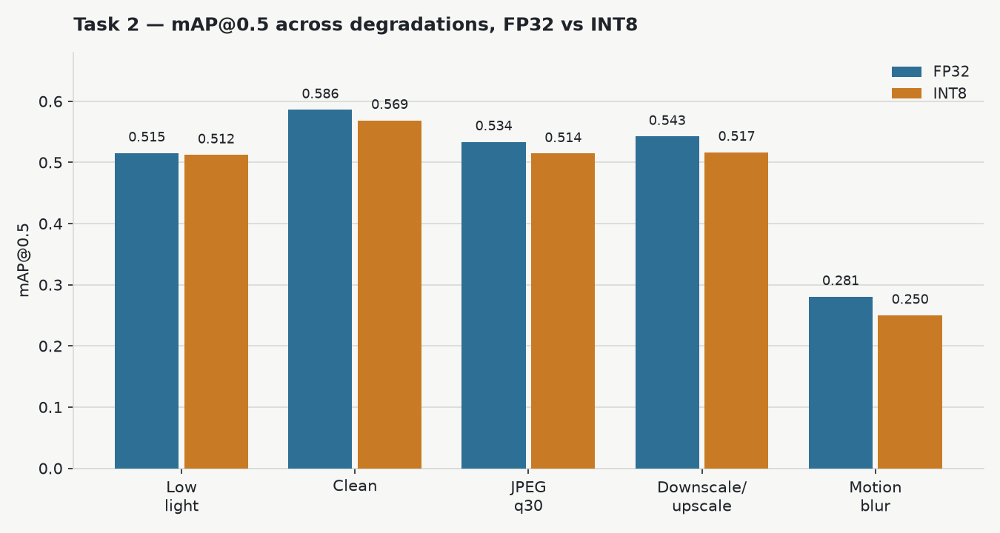
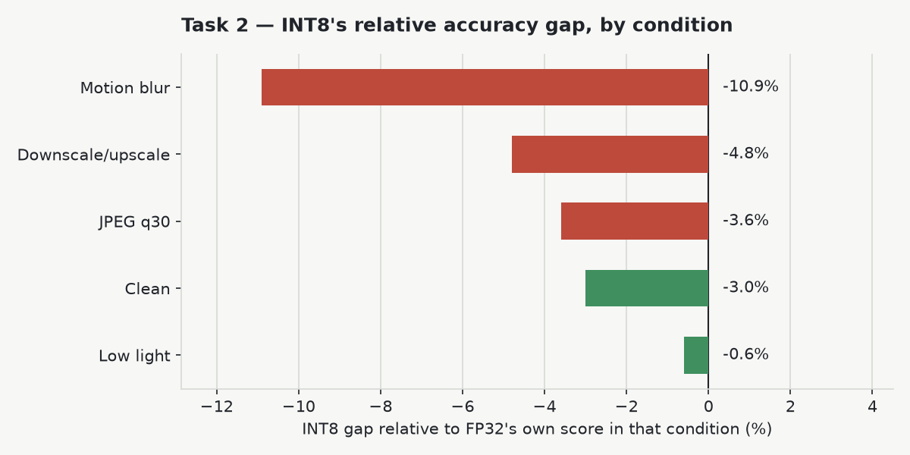
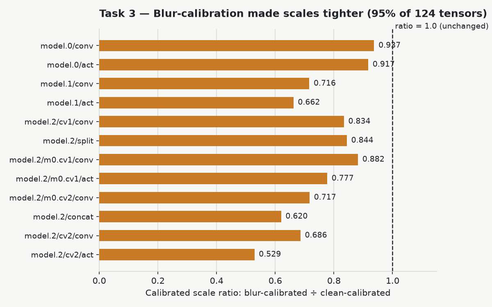

# INT8 Detection Under Degradation

How much does INT8 quantization actually cost a CPU object detector — in accuracy, and does that cost get worse when the input images are degraded? This project runs three connected experiments on YOLOv8n to find out, on a fixed 500-image, 5-class slice of COCO val2017.

- **Task 1** — establish an FP32 baseline, quantize to INT8, compare accuracy/latency/size
- **Task 2** — degrade: build four degraded copies of the eval set, run both models across all four, produce the 5×2 mAP@0.5 table
- **Task 3** — pick the worst degradation, make one targeted fix, and report honestly whether it worked

## Setup

**Model: YOLOv8n** (Ultralytics), pretrained on COCO. Chosen because it runs on CPU with no special hardware, ships with ready-to-use pretrained weights, and has a mature ONNX/INT8 export path — the last point matters most, since quantization tooling maturity was the whole point of the exercise.

**Eval set**: 500 images sampled from COCO val2017 (seed=42) that contain at least one instance of `person`, `car`, `bicycle`, `traffic light`, or `stop sign` — 2,353 ground-truth annotations across those 5 classes. A separate, disjoint pool of 120 images was set aside for INT8 calibration, so calibration data never leaks into the eval set.

**Hardware**: 12th Gen Intel Core i5-1245U (has `AVX-VNNI`, the instruction set that accelerates int8 ops on this CPU). All latency numbers are single-threaded (`intra_op_num_threads=1`, pinned to one core with `taskset -c 0`).

---

## Task 1 — FP32 baseline

The pretrained model was exported to a fixed 640×640 ONNX graph and evaluated with `pycocotools.COCOeval`, restricted to the 5 target classes.

| Metric | Value |
|---|---|
| mAP@0.5 | 0.5862 |
| mAP@0.5:0.95 | 0.4147 |
| AP@0.75 | 0.4342 |

**AP by object size** (COCO's standard area buckets: small <32²px, medium 32²–96²px, large >96²px — computed from the ground-truth box's pixel area in the original image, not the resized 640×640 input):

| Size | AP@[.5:.95] |
|---|---|
| Small | 0.2045 |
| Medium | 0.5978 |
| Large | 0.7186 |



This size split isn't arbitrary — it tracks a real mechanism in the model. YOLOv8 detects objects using three feature-map resolutions (stride 8/16/32, i.e. 80×80/40×40/20×20 grids over the 640×640 input): small objects are found using the finest, shallowest feature map, large objects using the coarsest, most context-rich one. That's why small-object accuracy is consistently the most fragile number in every experiment below — it has the least redundant signal behind it.

### Quantizing to INT8

Post-training **static** quantization via ONNX Runtime (`quantize_static`): QDQ format, U8S8 (unsigned int8 activations, signed int8 weights, ORT's recommended combo for x86-64), per-channel weights, calibrated on the 120 disjoint images. Two configuration bugs had to be diagnosed and fixed before this became the reported result:

1. **All detections vanished at first.** The graph's last op concatenates box coordinates (range ~0–640) with class-score sigmoids (range 0–1) into one output tensor. Quantizing that `Concat` gives the whole tensor one shared scale — calibrated for the 0–640 range, it rounds every class score below ~2.5 down to exactly 0. **Fix**: restrict quantization to `Conv` layers only, leaving the detection head in float (Conv holds ~all the FLOPs anyway, so this costs almost nothing).
2. **INT8 came out slower than FP32** (177ms vs 135ms/image). The first attempt used S8S8 (signed int8 for both activations and weights); ONNX Runtime's fast integer kernels on this CPU are built for **U8S8**, and S8S8 fell back to a slower generic path. **Fix**: switch the activation dtype to `QUInt8` — nothing else changed — which dropped inference to 64ms, the expected ~2x speedup.

### Accuracy, latency, size

| Metric | FP32 | INT8 | Difference |
|---|---|---|---|
| mAP@0.5 | 0.5862 | 0.5688 | −0.0174 (−3.0%) |
| mAP@0.5:0.95 | 0.4147 | 0.3944 | −0.0203 (−4.9%) |
| Latency, mean (1-thread) | 134.9 ms | 69.7 ms | **1.94x faster** |
| Latency, p95 | 138.6 ms | 72.0 ms | 1.93x faster |
| Model size (ONNX) | 12.85 MB | 3.60 MB | **3.57x smaller** |



| Class | FP32 AP@0.5 | INT8 AP@0.5 | FP32 AP@0.5:0.95 | INT8 AP@0.5:0.95 |
|---|---|---|---|---|
| person | 0.7751 | 0.7630 | 0.5291 | 0.5111 |
| bicycle | 0.4081 | 0.3885 | 0.2446 | 0.2356 |
| car | 0.5937 | 0.5879 | 0.3797 | 0.3704 |
| traffic light | 0.4361 | 0.4284 | 0.2326 | 0.2138 |
| stop sign | 0.7178 | 0.6761 | 0.6872 | 0.6411 |

Per-class AP shows INT8 preserved most of YOLOv8n's detection capability, with losses generally below 0.05 AP. The largest drops were on stop sign and traffic light — classes dominated by small, fine-detail objects that quantization error hits hardest.

| Size | FP32 AP@[.5:.95] | INT8 AP@[.5:.95] | Difference |
|---|---|---|---|
| Small (<32²px) | 0.2045 | 0.1658 | −0.0387 (**−18.9%**) |
| Medium (32²–96²px) | 0.5978 | 0.5730 | −0.0248 (−4.1%) |
| Large (>96²px) | 0.7186 | 0.7518 | +0.0331 (+4.6%) |



Small-object AP takes the largest relative hit (−18.9%) while large objects are essentially unaffected (+4.6%, within noise) — consistent with the size-mechanism explanation above: 8-bit resolution has the least room to spare exactly where the signal is already thinnest.

---

## Task 2 — Degrade

Four degraded copies of the same 500 images were built — all pixel-only transforms that preserve image dimensions, so the same ground-truth boxes apply unchanged to every condition:

| Degradation | Definition |
|---|---|
| Motion blur | 15×15 horizontal linear motion-blur kernel |
| Low light | Gamma correction, γ=2.5: `out = 255·(in/255)^2.5` |
| JPEG compression | Re-encoded at quality 30 |
| Downscale/upscale | Resize to 50% (`INTER_AREA`), then back up (`INTER_LINEAR`) |



**The 5×2 table — mAP@0.5, FP32 vs INT8, across conditions:**

| Condition | FP32 | INT8 |
|---|---|---|
| Clean | 0.5862 | 0.5688 |
| Motion blur | 0.2807 | 0.2502 |
| Low light | 0.5155 | 0.5124 |
| JPEG q30 | 0.5337 | 0.5145 |
| Downscale/upscale | 0.5426 | 0.5167 |



**Does INT8 lose more than FP32 under degradation than it does on clean images?** Comparing the INT8 gap *as a fraction of FP32's own score* in each condition (raw point-drops are misleading once FP32 itself collapses under blur):



**Answer: it depends on the degradation.** The gap widens sharply under motion blur (−3.0% clean → −10.9%), mildly under downscale/upscale, stays flat under JPEG, and actually *narrows* under low light.

Traced down to the object-size level for motion blur: the entire extra INT8 penalty concentrates in **medium-sized objects** (AP_medium 0.2586→0.1788, −30.9%) — small objects floor out near-zero for both precisions (there's nothing left to lose), and large objects are blur-resistant enough that quantization barely matters. Per class, edge/shape-dependent classes (`car` −20.3%, `traffic light` −34.3%) widen sharply while `person` — detected more from holistic shape/texture — barely moves (−4.6%). Blur destroys exactly the fine-edge information those classes need, and INT8's clean-calibrated resolution can't recover the weakened signal. Low light is a purely photometric, monotonic brightness remap — it never touches edges — so it doesn't create the same calibration/deployment mismatch.

---

## Task 3 — one targeted intervention

**Worst degradation: motion blur** — by far the largest relative INT8 gap. Diagnosed cause: INT8 quantization scales were calibrated via MinMax on 120 *clean* images, then applied unchanged to a blurred deployment distribution.

**Intervention** (one change only, everything else held fixed): recalibrate the identical quantization config using the same 120 calibration images with the same 15×15 motion-blur kernel applied. This tests the diagnosis directly, without confounding it with an architecture change.

### Result on the target condition — it did not work

| Model | mAP@0.5 | mAP@0.5:0.95 | AP_medium |
|---|---|---|---|
| FP32 | 0.2807 | 0.1876 | 0.2586 |
| INT8, clean-calibrated (original) | 0.2502 | 0.1695 | 0.1788 |
| INT8, blur-calibrated (new) | 0.2496 | 0.1702 | 0.1958 |

Net change vs. the original INT8 model: mAP@0.5 **−0.0006**, mAP@0.5:0.95 **+0.0007** — both noise-level. AP_medium did rise (+9.5% relative), but AP_large and AP_small both fell, cancelling it out. **The gap this was meant to close is still there.**

### An unexpected side effect — it improved clean-image accuracy instead

| Model | mAP@0.5 (clean) | mAP@0.5:0.95 (clean) |
|---|---|---|
| FP32 | 0.5862 | 0.4147 |
| INT8, clean-calibrated (original) | 0.5688 | 0.3944 |
| INT8, blur-calibrated (new) | 0.5824 | 0.3999 |

This closed 78% of the *original* clean-image INT8 gap — moving in the opposite direction from what was intended.

### Why — verified against the calibrated scales, not guessed



Pulling the actual per-tensor `_scale` constants out of both ONNX graphs (124 comparable tensors): blur-calibration made **95.2% of them tighter**, averaging **21% smaller**. Motion-blurred images suppress the sharp, high-contrast peak activations that clean images produce at hard edges, so MinMax calibration on blurred data settles on a narrower range — hence finer 8-bit resolution.

That finer resolution helped wherever *typical* (non-extreme) activation magnitudes dominate accuracy, which turned out to be the clean-image distribution — not the blurred target. Motion blur's damage is genuine information loss from spatial averaging; no amount of extra numeric precision recovers a signal that's already been averaged away.

### Cost

- **Model size**: 3,598,268 → 3,598,274 bytes (+6 bytes — identical graph, only scale/zero-point constants differ)
- **Latency**: 101.40ms → 101.62ms mean, full pipeline (<0.3% difference, within run-to-run noise, benchmarked back-to-back to rule out drift)

**Verdict**: a free intervention that doesn't fix the diagnosed problem. A calibration-data swap changes *where* the fixed 8-bit budget gets spent — it doesn't restore information a physically destructive degradation already removed. A more promising next step (not attempted, to keep this to one change) would be mixed precision on the earliest backbone layers (`model.1`/`model.2` — the layers with the largest scale shrinkage above), which do the initial edge extraction that motion blur most directly degrades.

---

## Workflow of script
```bash
# 0. Setup
python3 -m venv venv && source venv/bin/activate
pip install -r requirements.txt
```

```bash
# Task 1 — FP32 baseline, then quantize to INT8
python3 scripts/select_subset.py
python3 scripts/download_images.py data/eval_image_ids.txt data/images_eval
python3 scripts/download_images.py data/calib_image_ids.txt data/images_calib
python3 scripts/export_onnx.py
python3 scripts/evaluate.py models/yolov8n.onnx fp32
python3 scripts/benchmark_latency.py models/yolov8n.onnx fp32
python3 scripts/quantize.py data/images_calib models/yolov8n_int8.onnx
python3 scripts/evaluate.py models/yolov8n_int8.onnx int8
python3 scripts/benchmark_latency.py models/yolov8n_int8.onnx int8
```

```bash
# Task 2 — Degrade
python3 scripts/degrade.py
for cond in motion_blur low_light jpeg30 downup; do
  python3 scripts/evaluate.py models/yolov8n.onnx fp32_$cond data/images_eval_$cond
  python3 scripts/evaluate.py models/yolov8n_int8.onnx int8_$cond data/images_eval_$cond
done
```

```bash
# Task 3 — one targeted intervention
python3 scripts/blur_calib_images.py
python3 scripts/quantize.py data/images_calib_motion_blur models/yolov8n_int8_blurcalib.onnx
python3 scripts/evaluate.py models/yolov8n_int8_blurcalib.onnx int8blurcalib_motion_blur data/images_eval_motion_blur
python3 scripts/evaluate.py models/yolov8n_int8_blurcalib.onnx int8blurcalib_clean data/images_eval
python3 scripts/benchmark_latency.py models/yolov8n_int8_blurcalib.onnx int8blurcalib
```

```bash


## Project structure

```
scripts/    the pipeline above, one script per step, plus yolo_utils.py (shared pre/post-processing)
models/     yolov8n.pt, yolov8n.onnx, yolov8n_int8.onnx, yolov8n_int8_blurcalib.onnx
data/       eval/calib image sets + COCO annotation subset
results/    metrics_*.json, latency_*.json, figures/, report.md (full write-up), summary_report.docx
```

